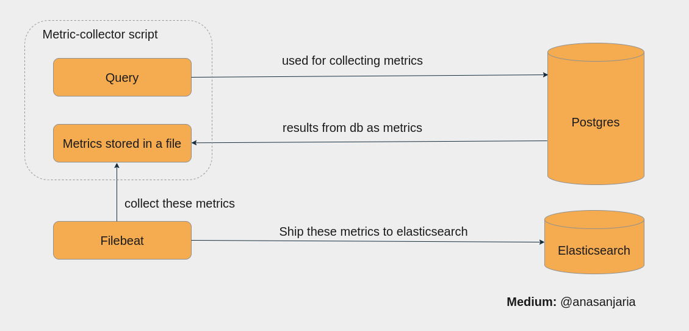

# Monitor Postgres using custom query



Metricbeat supports postgres monitoring using [postgres module](https://www.elastic.co/guide/en/beats/metricbeat/current/metricbeat-module-postgresql.html).

But sometimes we need to collect some custom metrics by using postgres queries as defined in this [aws post](https://aws.amazon.com/blogs/database/understanding-autovacuum-in-amazon-rds-for-postgresql-environments/).

This project aims to solve such problem that is it helps you to collect crucial metrics by using custom postgres query.

## How to use?
```
docker-compose up -d
```

## How to use it in the production system?
- You need to run this [script](db-metric-collector.sh) as a cron on specific instance. It collects metrics at regular
interval and dump it in a file.
- These metrics will be shipped by `filebeat` to your `elasticsearch`
- You can visualize these metrics using `kibana`.
- Add watchers to inform team in case of any problem.

## Resource
- Read complete article on [medium](https://medium.com/@anasanjaria/monitor-postgres-performance-using-custom-queries-1c06a766969b)
